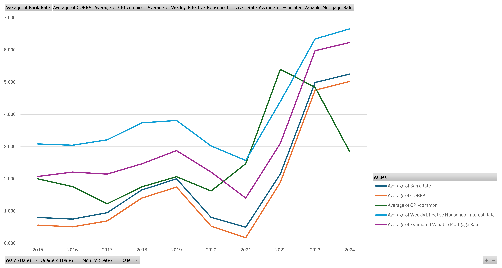
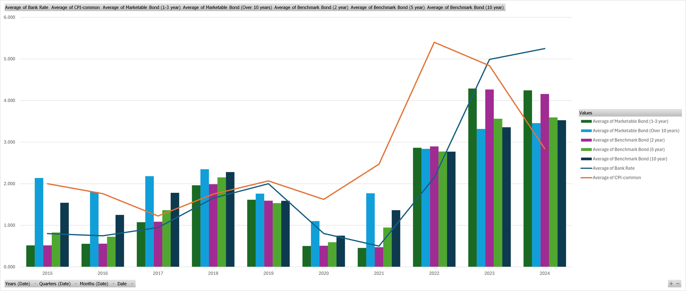
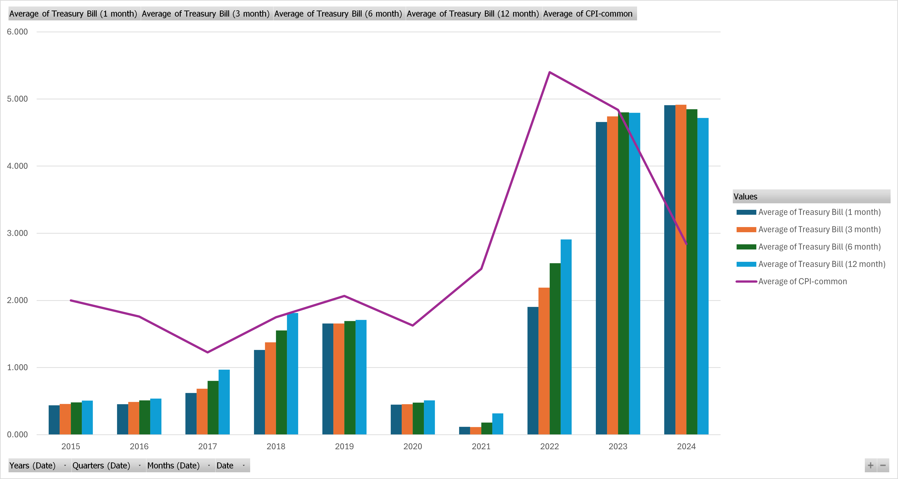
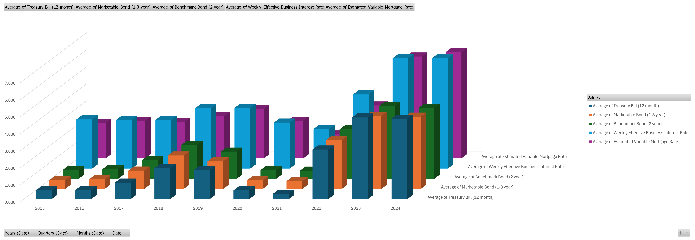
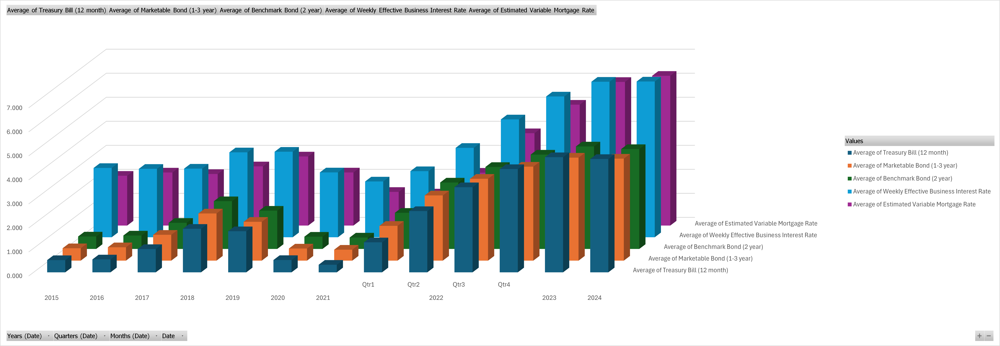
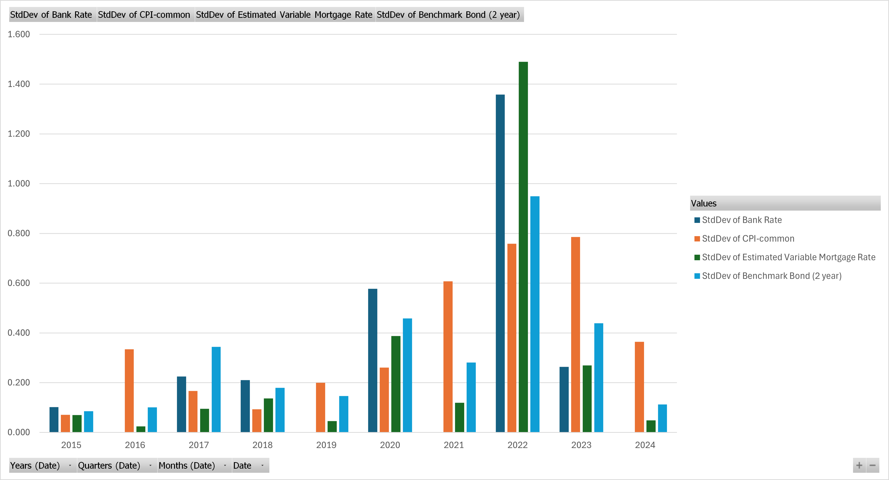

# FinancialAnalysis

## Overview
Basic analysis of financial measures from data provided by Bank of Canada and others.

## Project Structure
- `img/`: Contains examples of pivot charts created in Analysis.xlsx

## Preface
My interest in investments and various financial instruments began in early 2019 when IBM repurchased its stock and prices rose around 15%. Since then, I occasionally perused exchanges (e.g. TSX, NYSE, Nasdaq, KSE, etc.) for companies that I had an interest in and continued to venture into this foreign, but exciting, world. However, my motivation eventually stagnated as I found hobbies with less risk of losing money.

What rekindled my fire for investments was during COVID and the infamous GME short squeeze. Combined with the enhanced knowledge from various related courses, I started investing independently. With my stakes in the market, I began paying a lot more attention to monetary policy and financial news but never had a chance to fully utilize the toolset I gained during my university studies.

I understand this project is a very basic analysis of very basic financial measures that are mostly irrelevant in terms of investment strategy (unless you are a true believer of the weak and semi-strong forms of the EMH), but I created this so I could authenticate some preconceptions that I had and look at fun patterns that match any national/worldwide events!

## Excel Analysis
Utilized **IFERROR**,**VLOOKUP**, and some basic functions to merge and clean data from various csv files provided by sources below.

Created various pivot tables and charts for analysis. Please see below for examples and check out the [excel file](./Analysis.xlsx) as well! 

### Pivot Charts (Check out the sheets in [my analysis](./Analysis.xlsx))

  
  
We can see the BoC lower rates in 2020 and 2021 because of the pandemic, and eventually raise rates for inflation. The main point of interest for this chart would be the bank rate and CPI, and how COVID heavily affected our monetary policies.

  
  
This chart shows the trends in bond rates alongside the Bank Rate and CPI. The data highlights the impact of BoC's monetary policies on short-term and long-term bond yields, especially the significant shifts during the pandemic and subsequent recovery phase.

  
  
Similar to above, this chart compares the average rates of Treasury Bills with CPI. The sharp rise in Treasury Bill rates post-2021 illustrates the BoC's efforts to control inflation. 

  
  
This chart compares the average rates for T-Bills, Marketable Bonds, Benchmark Bonds, Weekly Effective Business Interest Rates, and Estimated Variable Mortgage Rates. Like most of the charts here, the data reflects the BoC policy impacts on both government and   commercial interest rates recently, with notable changes during and after the pandemic.

  
  
We can focus on the significant rate increase in 2022 across various financial instruments with this chart, showing the BoC's aggressive policy measures that we experienced recently. 

  
  
This chart shows the standard deviations of the various rates and CPI. The significant spike in 2022 and onwards highlight the increased volatility in financial markets and inflation during this period, reflecting the impact of BoC's monetary policy adjustments.

### Sources
https://www.bankofcanada.ca/rates/

https://www.bankofcanada.ca/rates/indicators/capacity-and-inflation-pressures/inflation/

https://ca.investing.com/

